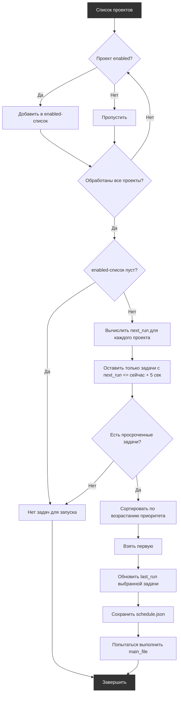

# RPA Scheduler  
## Открытый планировщик проектов PIX RPA
`Версия: [3.1] - 05-08-2026`

## Оглавление

- [Обзор](#обзор)
- [Требуемые компоненты](#требуемые-компоненты)
- [Структура проекта](#структура-проекта)
- [Конфигурация планировщика](#конфигурация-планировщика)
- [Конфигурация задач](#конфигурация-задач)
- [Критерии выбора](#критерии-выбора)
- [Ключевые параметры](#ключевые-параметры)
- [Примеры конфигурационных файлов](#примеры-конфигурационных-файлов)
  - [config.json](#configjson)
  - [schedule.json](#schedulejson)
- [Использование](#использование)
  - [Шаги внедрения](#шаги-внедрения)
  - [Запуск вручную (тестирование)](#запуск-вручную-тестирование)
  - [Типовые ошибки и диагностика](#типовые-ошибки-и-диагностика)
- [Поддержка](#поддержка)
- [Changelog](#changelog)

## Обзор  
**RPA Scheduler** — это централизованный планировщик задач для PIX‑роботов. Вместо того чтобы добавлять каждый скрипт в Планировщик Windows по отдельности и вручную контролировать их взаимные запуски, вы используете данный проект как единую точку входа.

Планировщик автоматически определяет, какую задачу запустить следующей, на основе:
- текущего времени,
- расписания (cron‑выражений),
- приоритетов,
- времени последнего запуска.

При каждом запуске (например, по триггеру из Task Scheduler) планировщик:

1. Анализирует конфигурацию всех подчинённых задач.
2. Выбирает задачу, которая должна выполняться в данный момент.
3. Обновляет `last_run` выбранной задачи и сохраняет изменённый `schedule.json`.
4. Запускает соответствующий `main.pix` и **дожидается его завершения**.

Такой подход исключает параллельное выполнение роботов, упрощает управление расписанием и централизует логику запуска.

## Требуемые компоненты
1. Восстановите зависимости по `src/nuget.config` и `src/packages.config` средствами PIX Studio. Для работы также требуется `pix-rpa-framework`.
2. Планировщик заданий Windows для автоматического запуска  
> ⚠️ Metadata проекта указывает PIX 3.2.0. Работа вручную проверена в PIX Studio 3.2.1. Более ранние версии PIX 3.x не проверены; PIX 2.x не поддерживается. ⚠️

### Особенности настройки зависимостей планировщика

Для работы в PIX Studio 3.0 планировщик использует файл `src\packages.config`, в котором перечислены все зависимости, доступные роботу‑шедулеру.

На текущий момент выполнены следующие действия по подготовке зависимостей:

1. В PIX Studio был создан **отдельный пустой проект**, к которому были **подключены все доступные на сегодня зависимости** (все пользовательские активности и библиотеки PIX).
2. Из этого проекта был выгружен его `packages.config` (около 430 пакетов).
3. Содержимое данного `packages.config` было скопировано и вставлено в `src\packages.config` планировщика `rpa_scheduler`.

Таким образом, на момент релиза (27.04.26) планировщик содержит **полный набор актуальных пакетов PIX**, и большинство проектов могут запускаться без дополнительной настройки зависимостей.

Однако:

- Если в будущем PIX Studio выпустит **новые библиотеки/активности**, и новый вызываемый проект начнёт их использовать,
- то для корректной работы через шедулер эти новые зависимости необходимо **добавить в `src\packages.config` планировщика вручную**.

Пока такие ситуации рассматриваются как частные случаи и обрабатываются по мере появления новых проектов/пакетов.

## Структура проекта

Проект организован следующим образом (некоторые каталоги создаются автоматически при первом запуске через `rpa_framework`):

```
rpa_scheduler
├───data
│   ├───configs
│   │       config.json             # Основные настройки робота
│   │       schedule.example.json   # Безопасный пример расписания
│   │       schedule.json           # Локальное расписание, не хранится в Git
│   ├───logs                        # Логи выполнения (создаётся фреймворком)
│   ├───tmp                         # Временные файлы (создаётся фреймворком)
│   ├───errors                      # Сохранённые ошибки/скриншоты (создаётся фреймворком)
│   └───transactions                # Данные транзакций (создаётся фреймворком)
│       ├───archive                 # Архив обработанных транзакций
│       └───transactions.csv        # Текущий файл транзакций
├───docs
│   └───readme.md                   # Документация проекта (текущий файл)
└───src
    ├───get_next_task_to_run.pix    # Скрипт выбора следующей задачи по расписанию
    ├───main.pix                    # Главный исполняемый скрипт
    └───rpa_scheduler.pixproj       # Файл проекта Pix Studio
```

## Конфигурация планировщика

Планировщик сам является проектом PIX и использует общий фреймворк `rpa_framework` (библиотеку вспомогательных скриптов). При запуске фреймворк инициализирует окружение, проверяет каталоги, а также пытается считать технические окна из конфигурационного файла проекта.

Чтобы фреймворк не выдавал ошибок, в корневой папке планировщика должен присутствовать файл `config.json`. Для использования инициализации через фреймворк (уведомления, работа с учётными данными, производственный календарь и т.д.) файл содержит множество дополнительных параметров, необходимых для работы фреймворка, но не используемых непосредственно планировщиком.

**Полный пример файла `config.json` приведён в разделе [Примеры конфигурационных файлов](#примеры-конфигурационных-файлов).**

## Конфигурация задач

Все задачи, управляемые планировщиком, описываются в локальном файле `schedule.json`. Создайте его копированием `schedule.example.json`; рабочий файл не хранится в Git, поскольку содержит машинные пути и изменяемое поле `last_run`.

**Полный пример файла `schedule.json` приведён в разделе [Примеры конфигурационных файлов](#примеры-конфигурационных-файлов).**

### Поля конфигурации задачи
- `enabled` — включена ли задача в планирование (true/false).
- `last_run` — дата и время последнего запуска в формате `dd.MM.yyyy HH:mm` (обновляется автоматически).
- `priority` — приоритет задачи (меньшее число = выше приоритет).
- `main_file` — полный путь к исполняемому файлу `main.pix` робота.
- `cron` — расписание в формате Quartz Cron.
- (опционально) `_comment_cron` — пояснение к cron-выражению (игнорируется планировщиком, полезно для расшифровки сотрудником).

> ⚠️ **Важно**: частота запуска самого планировщика (через Task Scheduler) должна быть **выше или равна** самому короткому интервалу в cron‑выражениях задач, иначе некоторые запуски могут пропускаться.  
> Для генерации cron‑выражений удобно использовать [онлайн‑инструмент](https://www.freeformatter.com/cron-expression-generator-quartz.html).

Вход `CronScheduler.LastRun` должен получать сохранённое значение `schedule.json:last_run`, разобранное строго в формате `dd.MM.yyyy HH:mm`:

```csharp
DateTime.ParseExact(
    project["last_run"].ToString(),
    "dd.MM.yyyy HH:mm",
    System.Globalization.CultureInfo.InvariantCulture)
```

Передавать в `LastRun` значение `DateTime.Now` нельзя: активность вычисляет первое cron-срабатывание строго после переданного времени, поэтому при таком подключении будет найден только будущий триггер, а уже наступивший запуск не попадёт в выборку.

## Критерии выбора


Для каждой включённой задачи `NextRun` — первое cron-срабатывание строго после сохранённого `last_run`. Задача считается готовой, если `NextRun <= DateTime.Now.AddSeconds(5)`. Если после `last_run` было пропущено несколько срабатываний, они объединяются в один запуск: после выбора задачи `last_run` сразу устанавливается в текущее время.

> ⚠️ Поле `last_run` обновляется после выбора задачи и сохраняется в исходный `schedule.json` **до** попытки выполнения `main_file`. Если запуск подчинённого проекта завершится ошибкой, планировщик не выполнит автоматический повтор до следующего cron-срабатывания.

## Ключевые параметры

В процессе работы планировщик определяет следующие параметры для запуска выбранной задачи:

| Ключ | Тип | Описание |
|------|-----|----------|
| `selected_project_name` | `string` | Имя проекта из `schedule.json`, который требуется запустить |
| `main_file` | `string` | Путь к файлу `main.pix` этого проекта |

Эти параметры используются только внутри планировщика и не возвращаются во внешнюю среду. После выполнения обновляется только поле `last_run` в конфигурации.

## Примеры конфигурационных файлов

Здесь приведены полные примеры файлов `config.json` и `schedule.json` с типовыми настройками.  
Чувствительные данные (пути, email, имена учётных записей) заменены на обобщённые.

### config.json

```json
{
    "metadata": {
        "version": "3.0",
        "description": "RPA Scheduler config",
        "contact_us": "support@example.com"
    },
    "process": {
        "name": "Планировщик роботов",
        "log_config_on_init": false,
        "log_state_monitor": false
    },
    "transaction_handling": {
        "max_serial_errors": 3,
        "max_batch_size": 10,
        "seconds_per_transaction": 60,
        "base_delay_sec": 10,
        "notification": {
            "enabled": false,
            "interval": 5
        }
    },
    "maintenance": {
        "enabled": false,
        "cron": "0 0 2 ? * SUN *",
        "window_ahead_min": 10
    },
    "credentials": {
        "names": ["Email"]
    },
    "notifications": {
        "recipients": ["your-email@example.com"],
        "smtp": {
            "server": "smtp.example.com",
            "port": 587
        },
        "imap": {
            "server": "imap.example.com",
            "port": 993
        },
        "ssl": true
    },
    "production_calendar": {
        "enabled": false,
        "country": "ru"
    },
    "1c_settings": [],
    "cleanup": {
        "processes": {
            "names": ["excel", "firefox"]
        },
        "transactions": {
            "lifetime_days": 30
        },
        "logs": {
            "lifetime_days": 30,
            "archive_instead_of_delete": true
        },
        "errors": {
            "lifetime_days": 30
        }
    }
}
```

### schedule.json

```json
{
  "Example robot A": {
    "enabled": false,
    "last_run": "01.01.2000 00:00",
    "priority": 1,
    "main_file": "C:\\RPA\\Projects\\example-robot-a\\src\\main.pix",
    "cron": "0 0 9 ? * MON-FRI *"
  },
  "Example robot B": {
    "enabled": false,
    "last_run": "01.01.2000 00:00",
    "priority": 2,
    "main_file": "C:\\RPA\\Projects\\example-robot-b\\src\\main.pix",
    "cron": "0 0 18 ? * MON-FRI *"
  }
}
```

> ⚠️ В примере `schedule.json` пути к файлам указаны как абсолютные. При развёртывании замените их на актуальные пути в вашей системе. Поле `last_run` обновляется после выбора задачи, до попытки запуска её `main_file`.

## Использование

### Шаги внедрения

1. **Настройте расписание роботов**  
   Скопируйте `schedule.example.json` в `schedule.json`. Для каждого робота задайте `enabled`, `main_file`, `cron`, `priority` и, при необходимости, `maintenance`.
   *Обратитесь к разделу [Конфигурация задач](#конфигурация-задач) и [примеру schedule.json](#schedulejson) для правильного заполнения.*

2. **Импортируйте пользовательские активности**  
   Восстановите библиотеки по включённым в проект `nuget.config` и `packages.config`. Убедитесь, что проект запускается без ошибок.

3. **Запланируйте запуск планировщика**  
   Создайте задачу в Планировщике Windows, которая будет запускать `main.pix` с нужной периодичностью (например, раз в 5 минут). Частота должна быть не реже, чем минимальный интервал в cron‑задачах.  
   Для запуска планировщика (например, при настройке задачи в Планировщике Windows или для быстрого тестирования) используйте команду:

    ```cmd
    "C:\Program Files\PIX\Robot.exe" -f "C:\Путь\к\вашему\планировщику\main.pix"
    ```
    - **`"C:\Program Files\PIX\Robot.exe"`** — исполняемый файл PIX Robot. Путь может отличаться в зависимости от места установки.
    - **`-f`** — параметр, указывающий на запуск конкретного файла `.pix`.
    - **`"C:\Путь\к\вашему\планировщику\main.pix"`** — полный путь до главного файла планировщика. Замените на актуальный путь в вашей системе.

      При таком вызове планировщик выполнит одну итерацию: проанализирует конфигурацию, при необходимости запустит выбранного робота и завершится. Для постоянной работы эту команду следует поместить в Планировщик Windows с требуемой периодичностью.

4. **Мониторинг**  
   Планировщик самостоятельно определяет необходимость запуска. Если в текущий момент нечего запускать, он завершается без действий. Логи и ошибки записываются в стандартный каталог `rpa_scheduler\data\logs`.

### Запуск вручную (тестирование)

- Откройте `main.pix` в PIX Studio.
- В Variables замените compile-time индикативы `PIX_RPA_FRAMEWORK_ROOT` и `PIX_RPA_SCHEDULER_ROOT` валидными C#-строками с реальными путями. До этого проект намеренно не компилируется.
- Выполните скрипт. При необходимости проанализируйте лог‑файлы.

### Типовые ошибки и диагностика

| Проблема | Возможные причины |
|----------|-------------------|
| Нужный робот не запускается | Неверное cron‑выражение, слишком редкий запуск планировщика, выключен `enabled` |
| Рассчитывается только будущее срабатывание, хотя задача уже должна была запуститься | В `CronScheduler.LastRun` ошибочно передан `DateTime.Now` вместо сохранённого `schedule.json:last_run` |
| Ошибка при расчёте следующего запуска | Значение `last_run` не соответствует точному формату `dd.MM.yyyy HH:mm` |
| Ошибки при выполнении робота | Неправильные пути к каталогам/файлам, ошибки в `schedule.json` (некорректный JSON) |

В первую очередь проверяйте логи в `data/logs` и корректность конфигурации.

---

### Поддержка
При проблемах или предложениях: `Aidar Bikmukhametov <ARBikmuhametov@yandex.ru>`
Сообщения об ошибках должны содержать:  
- Контекст выполнения
- Ожидаемый и фактический результат

---

# Changelog
  <!-- ### Добавлено (Added) -->
  <!-- ### Изменено (Changed) -->
  <!-- ### Исправлено (Fixed) -->
  <!-- ### Удалено (Removed) -->
  <!-- ## [Unreleased] -->

 ## [3.1] — 05-08-2026
 ### Изменено (Changed)
 - **Usability: текст лог-сообщения в заголовке шага вызова `write_log.pix`.** Во всех шагах вызова `write_log.pix` внутри планировщика текст лог-сообщения скопирован в поле «заголовок шага». При чтении скрипта глазами сразу видно, что логируется — без открытия параметров шага.

 ## [3.0] — 27-04-2026
 ### Изменено (Changed)
 - Выполнена миграция проекта `rpa_scheduler` на PIX Studio v3.0.
 - В разделе «Требуемые компоненты» обновлено требование по версии PIX Studio: планировщик теперь рассчитан на работу в PIX 3.0 и выше; формулировка о совместимости только с PIX 2.x удалена/уточнена.
 - Документация в `docs/readme.md` приведена в соответствие с актуальной структурой проекта и шагами внедрения, включая описание ручного и планового запуска через `Robot.exe`.

  ## [2.1.2] - 15-11-2025
  ### Исправлено (Fixed)
  * В шаге выбора следующей задачи для запуска добавлен временной допуск в 5 секунд при сравнении времени (`next_run <= Now + 5 секунд`). Это позволяет корректно запускать задачи, даже если они рассчитаны с точностью до секунд, и предотвращает случайный пропуск задач из-за разницы в долях секунды между расчетом и фактическим временем проверки.

  ## [2.1.1] - 08-10-2025
  ### Исправлено (Fixed)
  * В скрипте `get_next_task_to_run.pix` для шага "Расчет времени запуска по CRON" параметр `Время последнего запуска` сделан обязательным.

  ## [2.1.0] - 01-09-2025
  ### Добавлено (Added)
  * В конфигурационный файл (`config.json`) добавлен блок `maintenance` для задания технических окон по cron-выражению. Теперь можно гибко указать периоды, в которые робот не должен работать.
  - **Проверка на старте:** Перед запуском робот проверяет, попадает ли текущее время в техническое окно. Это позволяет избежать случайных запусков в период недоступности даже при ошибках в расписании.
  - **Проверка в цикле обработки:** Во время длительной работы робот контролирует наступление технического окна и при необходимости завершает текущий цикл обработки, чтобы не нарушать регламент.
  - **Параметр `window_ahead_min`:** Позволяет задавать минимальное количество минут до начала технического окна, необходимое для запуска новой транзакции. Если до технического окна меньше указанного значения, новая обработка не запускается.

  Пример конфигурации:
  ```json
  "maintenance": {
      "_comment": "Тех. окна по одному cron-выражению. Если время попадает под любой из указанных дней/часов — робот не работает.",
      "enabled": false,
      "cron": "0 0 2 ? * SUN *",
      "_comment_cron": "Пример: каждое воскресенье в 02:00. Настройте под собственное техническое окно перед включением",
      "window_ahead_min": 10,
      "_comment_window_ahead_min": "Минимальное количество минут до наступления технического окна, которое должно оставаться для запуска новой транзакции."
  }
  ```

  ## [2.0.0] - 05-08-2025
  ### Добавлено (Added)
  * Добавлена поддержка CRON-выражений через использование библиотеки `Quartz.dll`  
  ### Изменено (Changed)
  * Изменена структура конфигурационного файла `schedule.json`: окна запусков заменены на cron-выражение
